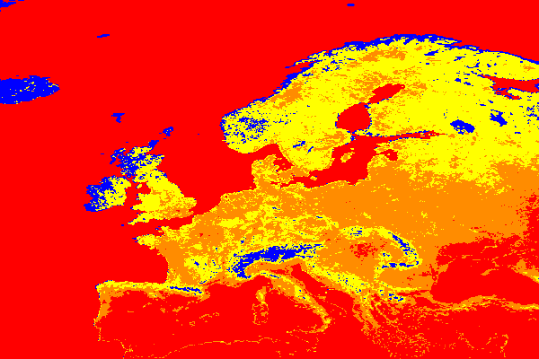

## Group 38's Sprint 1 Software Engineering Project's Functions

This repository contains functions developed by Group 38 for their sprint 1 software engineering project. These functions are designed to handle connections with a datacube server and execute queries to retrieve specific data. Below is an instruction set on how to use these functions to create your own queries.

### Instructions:

1. **Import the Necessary Classes:**

   ```python
   from wdc import dbc, dbo
   ```

2. **Set Up Server Connection:**

   - Define the URL of the server you want to connect to.
   - Create a `dbc` object by passing the server URL.
     ```python
     server_url = "https://ows.rasdaman.org/rasdaman/ows?REQUEST=GetCoverage"
     dbc_connection = dbc(server_url)
     ```

3. **Create Datacube Object:**

   - Specify the coverage you want to work with (for the sake of this example, we will be using AvgLandTemp)
   - Create a `dbo` object by passing the connection and coverage.
     ```python
     coverage = 'AvgLandTemp'
     dbo_object = dbo(dbc_connection, coverage)
     ```

4. **Build Your Queries:**

   - Utilize the provided methods within the `dbo` class to construct your queries. Each method corresponds to a specific WCPS query
   - Provide the necessary parameters for the query method you're using (for the sake of this example, we will be using the `max` query and the parameters for that are `lat, lon, ansi_start, ansi_end`.
     ```python
     lat = 53.08
     lon = 8.80
     ansi_start = "2014-04-02"
     ansi_end = "2014-09-11"
     ```

5. **Execute Your Queries:**
   - Call the `execute_query` method of the `dbc` object and pass your query.
   - Store or utilize the result as needed.
     ```python
     query = dbo_object.maximum(lat=lat, lon=lon, ansi_start=ansi_start, ansi_end=ansi_end)
     result = dbc_connection.execute_query(query=query)
     print(result)
     ```

### Sample Usage:

Below is a sample code snippet demonstrating the usage of the provided functions to execute the `max` WCPS query.

```python
from wdc import dbc, dbo

server_url = "https://ows.rasdaman.org/rasdaman/ows?REQUEST=GetCoverage"
dc_connection = dbc(server_url)
coverage = 'AvgLandTemp'
dc_object = dbo(dc_connection, coverage)
lat = 53.08
lon = 8.80
ansi_start = "2014-04-02"
ansi_end = "2014-09-11"

query = dc_object.maximum(lat=lat, lon=lon, ansi_start=ansi_start, ansi_end=ansi_end)
result = dc_connection.execute_query(query=query)
print(result)
```

### Testing:

Below is a sample code snippet demonstrating a test for one of many provided functions to make heatmap of specified locations at a specific time.

```python
from wdc import dbc, dbo

server_url = "https://ows.rasdaman.org/rasdaman/ows?REQUEST=GetCoverage"
dc_connection = dbc(server_url)
coverage = 'AvgLandTemp'
dc_object = dbo(dc_connection, coverage)
lat_start = 35
lat_end = 75
lon_start = -20
lon_end = 40
ansi_start = "2014-07"

query = dc_object.on_the_fly_colouring(lat_start, lat_end, lon_start, lon_end, ansi)
result = dc_connection.execute_query(query=query)

expected_query = """
image>>for $c in ( AvgLandTemp ) 
        return encode(
            switch 
                    case $c[ansi("2014-07"), Lat(35:75), Long(-20:40)] = 99999 
                        return {red: 255; green: 255; blue: 255}
                    case 18 > $c[ansi("2014-07"), Lat(35:75), Long(-20:40)] 
                        return {red: 0; green: 0; blue: 255} 
                    case 23 > $c[ansi("2014-07"), Lat(35:75), Long(-20:40)] 
                        return {red: 255; green: 255; blue: 0} 
                    case 30 > $c[ansi("2014-07"), Lat(35:75), Long(-20:40)]  
                        return {red: 255; green: 140; blue: 0}
                    default return {red: 255; green: 0; blue: 0}
                , "image/png")
"""

assert query.strip() == expected_query.strip(), "Test Case Failed"
print("'on_the_fly_colouring' function Test Case Passed\n")
```

The test passes and displays an appropriate message to indicate the success. By passing this query, you will get the following heatmap as a result:




### Notes:

- Ensure that the server URL provided is correct and accessible.
- Verify that the coverage specified exists on the server.
- Provide valid latitude, longitude, and time range parameters according to the data available on the server.
